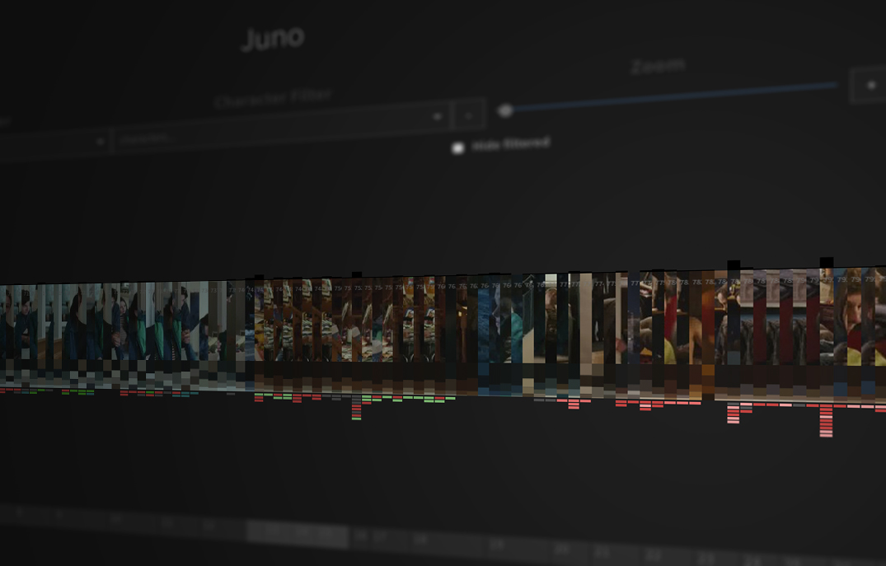

# General
This website visualizes film shot data. You can filter shots by characters and subtitles. For improved navigation one can use the dvd-chapters toolbar.
That data is retrieved from a [mongoDB](https://www.mongodb.com) and a [minio](https://minio.io/) assets server.
The application is split into frontend (React.js, Redux, d3.js) and backend (express), which is connected to the data stores.

# Setup

## Prerequisites

You will need to have [node](https://nodejs.org/en/) with npm installed.


To install all dependencies run:

```
npm install
```

## Environment Variables

The 
Copy `.env.server.example` to `.env.server` and set the variables to your needs. These env variables are used for the backend.
Also copy `.env.example` to `.env` and adjust the variables. These env variables are used for the frontend.

# Run

For the app to work you need the mongoDB and minio server running.

## Development

To run the app in development you have to start two processes. On for the frontend, which starts a webpack development server, the other for the backend, which starts the express app.

```
npm run dev:client
```

```
npm run dev:server
```

## Production

In production we use only one backend server, which provides the minified frontend code for all requests except `/api`.

To fill the browser with data please refere to [FilmAnalyzerKit](https://github.com/Miiha/FilmAnalyzerKit).

